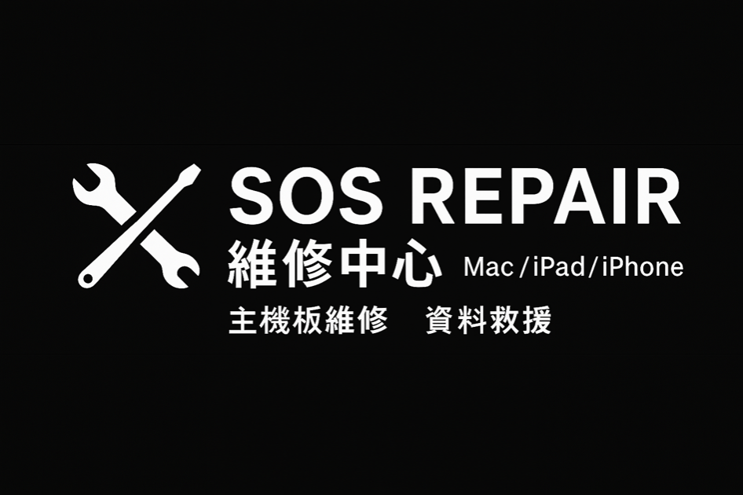
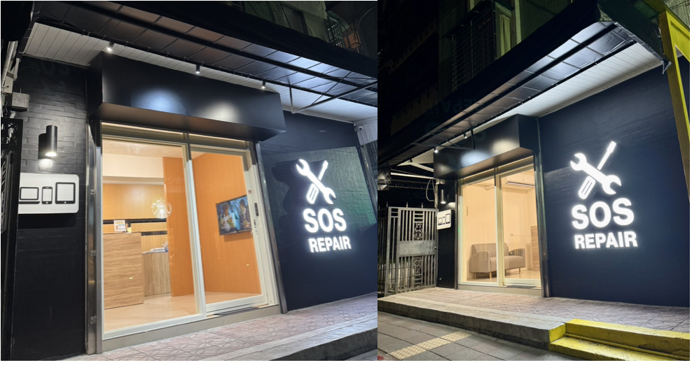
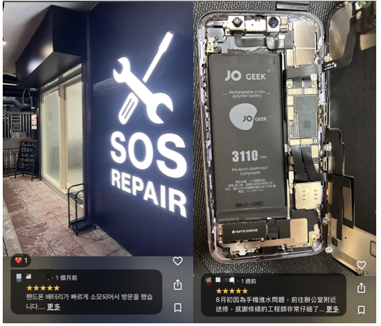

Introduction

目的：架設一個手機維修中心的行銷網站, 提供客戶足夠的資訊, line 聯絡資訊, 及ＳＥＯ優化後台，提供行銷人員做編輯

範圍：
    - NextJS 架設前端頁面
    - Sanity 當作後台輸入網站內容與SEO設定
    - Github 連動 Vecel架站服務

# 蘋果手機/筆電維修店 官網需求表單題目清單

## 基本資訊

1. 店家名稱（中文 / 英文）SOS Repair維修中心/SOS Repair
2. LOGO 檔案（如有）

## 服務項目

主要服務項目（可多選）
☑MacBook 免費檢測.專業維修

無法開機、鍵盤故障、觸控板失靈、潑到水、螢幕破裂、顯示異常、無法充電、蓄電不佳、速度太慢、主機板異常

☑iMac 免費檢測.專業維修

無法開機、潑到水、螢幕破裂、顯示異常、速度太慢、喇叭破音、主機板異常

☑iPad 免費檢測.專業維修

無法開機、面板破裂、顯示異常、無充電反應、喇叭破音、泡水、蓄電不佳、按鍵失靈、主機板異常

☑iPhone 免費檢測.專業維修

無法開機、蓄電不佳、泡水、螢幕破裂、顯示異常、觸控失靈、聽筒無聲、無充電反應

主機板異常
☑配件販售(手機殼 / 充電器)
☑二手機買賣

## 官網內容區塊

1. 希望官網包含的區塊（可多選）
   　☑ 首屏 Banner（大圖 / slogan）
   　☑品牌介紹（品牌理念 / 創立故事）
   　☑服務介紹
   　☑ 客戶評價 / 成功案例

　☑ 聯絡方式（電話 / LINE）
　☑Google 地圖位置、商業檔案

## 文案需求

1. 官網 slogan / 標語
2. 品牌介紹 / 公司簡介 / 維修理念

快速、精準、負責

蘋果產品，免費檢測，誠信開立發票

iPhone ｜iPad｜Mac

SOS Repair 成立的初衷，是希望在台北市中心，提供一個交通方便、且快速服務的 **Apple 專業維修據點**。

我們深知，您的 iPhone、iPad、MacBook 不只是工具，更承載著生活、工作與回憶。

維修團隊由多位 擁有超過 10 年維修經驗的專業工程師組成。

他們不僅熟悉蘋果各世代產品的架構，精通 **主機板維修、晶片更換、資料救援** 等精密工序，能在最短時間內，提供最高品質的解決方案。

為了讓顧客更安心，我們堅持：

1️⃣**專業標準**：每一項維修都依照嚴謹流程操作，避免二次損傷。

2️⃣**嚴選零件**：自收貨確認、功能測試、上機穩定性，3階段流程，只使用高品質零件。零件維修後提供完整保固一年服務；主機板根據問題點提供半年保固。

3️⃣**持續精進**：定期引進最新維修設備與技術，與 Apple 新機同步進化。

在 SOS Repair，您得到的不只是「修好一台機器」，更是 **安心、信任與保障**。

## 圖片 / 素材

1. 是否有門市照片？（單選）☑有 □ 沒有

## 聯絡資訊

1. 聯絡電話 02-2396-0505
2. LINE 官方帳號 <https://lin.ee/sSZiFBV> (@616zrzay)

1. Facebook / IG 粉專

FB: https://pse.is/82cjls

IG : https://www.instagram.com/sosrepair\_\_/

1. Email：sosrepair0505@gmail.com
2. 地址：台北市中正區青島東路21-3號

Functional Spec

### FR1: 參考https://houseifix.com/ 網頁版面設計 使用firecrawl. 抓取版面配置 偏向溫暖色調
### FR2: 整個色系參考圖片：https://static.wixstatic.com/media/5a0c2d_1a495b551538452e957be1f5bda6f602~mv2.jpg/v1/crop/x_0,y_36,w_1108,h_780/fill/w_1108,h_771,al_c,q_85,enc_avif,quality_auto/S__74776596_0_edited.jpg 

### FR3: 網頁內容參照 上方的 ”蘋果手機/筆電維修店 官網需求表單題目清單“

